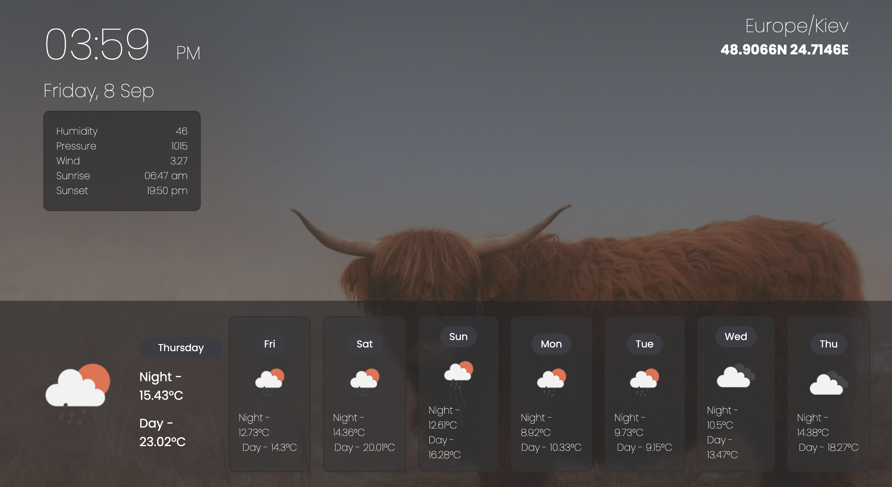
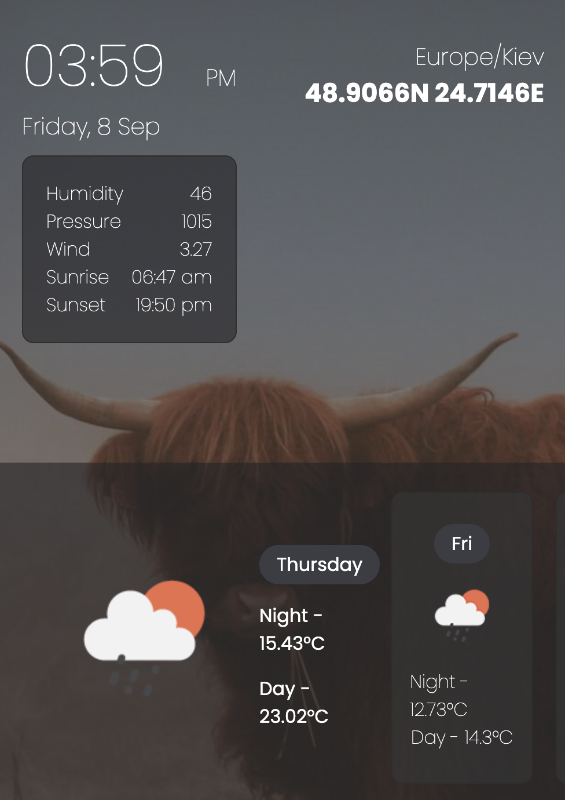

# Weather app

## Description
Weather forecast app with API

## Developer experience
- practiced using OpenWeatherMap API
- getting geolocation from navigator
- getting current date and time
- asynchronous actions
- HTTP requests
- working with data in JSON format
- modifying the HTML code from JS

